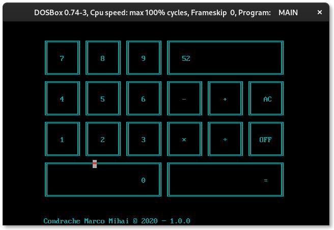

# CalC8086

A simple calculator written in Assembly for 8086 processors.

It handles the 4 operations with operands that have a maximum of 4 digits.

## Compilation

I have used TASM, and TLINK to build the program running on a dos emulator (DosBox).

You can use the file "compile.bat" to compile the program

```dos
compile
```

## Execution

For the execution you have only to run the .com generated file

```dos
main
```

## Closing

You could close the program by click on the OFF button.

## Preview



## Explanation

### Addition

The program can handle addition between numbers with 16 bit representation.

For example 5555 + 5555 will give you 11110

### Subctration

The program can handle subctration between numbers with 16 bit representation.

It also handle negative subctration

For example 52 - 23 will give you 29

But 23 - 52 will give you -29

### Multiplication

With 16 bit the maximum representable number is 65536
CalC8086 allows multiplication between 16 bit numbers but when the result is greater than 65536 it will display 'Overflow' in the output panel

So for example 333 x 1 will give 333 but
333 x 333 will print on the panel 'Overflow' because the result is 110889 that is greater than 65536

### Division

You could do division with all 4 digits numbers.
Be careful not to enter zero as the second number.
If this happens the program'll print 'Error' because the operation
n / 0 is mathematical impossible.
The program also handles the remainder value for non integer results.

For example 55 / 11 will give you 5 but 23 / 2 will give you 11 with a remainder of 1.

5550 / 0 will print 'Error' on the output panel

## Development

### Contributing

Long-term discussion and bug reports are maintained via GitHub Issues. Code review is done via GitHub Pull Requests.
